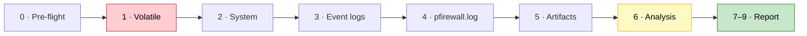

<div align="center">

# 🛡️ SOC Live Response Collector

**A single PowerShell script for evidence collection and first-pass triage of a Windows host**

[](#1-requirements)
[](#1-requirements)
[](https://csrc.nist.gov/pubs/sp/800/86/final)
[](soc-collect.ps1)
[](#1-requirements)

**🇬🇧 English** · [🇺🇦 Українська](README.uk.md)

</div>

---

`soc-collect.ps1` — **SOC Live Response Collector v1.1**. It replaces the old main audit + `fwlog.ps1` +
`filesinter.ps1` with one file: it collects volatile data, persistence, event logs, `pfirewall.log` and file
artifacts, correlates them, and builds a timeline and a self-contained HTML report — with chain of custody and
a SHA256 manifest. Order of collection and handling principles follow **NIST SP 800-86**.

> [!NOTE]
> The script's console output, HTML report and CSV column notes are in **Ukrainian**.

<table>
<tr>
<td width="50%" valign="top">

### ✨ Features

- ⚡ **Volatile data first** — processes, network, sessions, DNS/ARP
- 🔍 **IOC hunting** by file name, SHA256 and IP across every source
- 📜 **Event logs** — authentication, RDP, services, tasks, firewall, Defender, Sysmon, PowerShell 4104
- 🧱 **pfirewall.log** — summaries, scan / RDP / SMB heuristics
- 🗂️ **Artifacts** — LNK, BAM/DAM, Prefetch, Recycle Bin, MotW, browser history

</td>
<td width="50%" valign="top">

### 🔐 Forensically sound

- 🧾 **Chain of custody** — every action with UTC time and operator
- #️⃣ **Hash before → copy → hash after** for every evidence copy
- 🕒 **MAC times** captured before reading and re-checked after
- 📦 **SHA256 manifest** + ZIP with its own hash
- 🌐 **HTML report with no external resources** — opens on an air-gapped machine

</td>
</tr>
</table>

## ⚡ Quick start

```powershell
# Elevated PowerShell console
powershell.exe -ExecutionPolicy Bypass -File C:\1\soc-collect.ps1 -CaseId INC-0922
```

Then open `C:\SOC_Evidence\<CaseId>_<HOST>_<timestamp>Z\report.html` in a browser.

> [!WARNING]
> The default IOCs and name masks are tuned for the **KMSAuto** training case. For a new case you **must** pass your
> own `-NamePatterns`, `-IocIPs`, `-IocSha256`, `-KnownPaths` — otherwise `*activ*` alone yields hundreds of false positives.

<details>
<summary><b>📑 Table of contents</b></summary>

1. [Requirements](#1-requirements)
2. [How to run](#2-how-to-run)
3. [Parameters](#3-parameters)
4. [Typical scenarios](#4-typical-scenarios)
5. [Collection stages](#5-collection-stages)
6. [Output](#6-output)
7. [PowerShell 5.1 compatibility](#7-powershell-51-compatibility)
8. [Troubleshooting](#8-troubleshooting)
9. [Limitations](#9-limitations-honestly)

</details>

---

## 1. Requirements

| What | Requirement |
|---|---|
| PowerShell | **Windows PowerShell 5.1** (built into Windows 10/11, Server 2016+) or PowerShell 7.x on Windows, 64-bit process, `FullLanguage` mode. Checked **before** anything is written to disk (`#Requires -Version 5.1` + runtime check, exit code `2`) |
| Privileges | **Administrator** (without it there is no Security log, BAM and some other data; the script warns you) |
| OS | Windows 10 / 11, Windows Server 2016 / 2019 / 2022 / 2025 |
| File encoding | UTF-8 **with BOM** — don't re-save it without BOM, or Cyrillic breaks in 5.1 |
| Third-party tools | None |

> [!NOTE]
> Tested: v1.0 — full run on Windows 11 / PowerShell 5.1.26100, **34/34 steps without errors**.
> v1.1 passed a parser check and unit tests of the changed functions; a full run on Windows is still pending — see [CHANGELOG](CHANGELOG.md).

> [!TIP]
> Get the script via **Download raw file** or `git clone` — the repository stores it byte-for-byte
> (BOM + CRLF, see `.gitattributes`). Copy-pasting from the GitHub page into an editor may drop the BOM.

---

## 2. How to run

### 2.1 Via `-File` — recommended

```powershell
powershell.exe -ExecutionPolicy Bypass -File C:\1\soc-collect.ps1 -CaseId INC-0922
```

- SHA256 is computed from the script file itself (best option for chain of custody).
- **Lists are passed as one comma-separated string** — the script splits them:
  ```powershell
  -IocIPs '192.168.23.51,10.3.0.20' -NamePatterns '*KMS*,*SECOPatcher*'
  ```

### 2.2 Via scriptblock

```powershell
powershell.exe -ExecutionPolicy Bypass -Command "& ([scriptblock]::Create((Get-Content -Raw -Encoding UTF8 'C:\1\soc-collect.ps1'))) -CaseId INC-0922 -IocIPs @('192.168.23.51','10.3.0.20')"
```

- Arrays work natively via `@(...)`.
- The hash is taken from the script text (may differ from the file hash because of BOM/line endings — the report says so).

### 2.3 From an already open elevated console

```powershell
Set-ExecutionPolicy -Scope Process Bypass
cd C:\1
.\soc-collect.ps1 -CaseId INC-0922 -Hours 72
```

### 2.4 Remotely (WinRM)

```powershell
Invoke-Command -ComputerName PC-17 -FilePath C:\1\soc-collect.ps1 -ArgumentList 'HUNT-PC17'
```

- `-ArgumentList` passes parameters **by position only** (the first one is `CaseId`).
- Results stay on the remote host in `C:\SOC_Evidence` — retrieve them after collection.

---

## 3. Parameters

### 🗂️ Case and time window

| Parameter | Default | Description |
|---|---|---|
| `-CaseId` | `INC-testPC_1-KMSAuto` | Case identifier (used in folder and report names) |
| `-Analyst` | — | Analyst name for chain of custody |
| `-Hours` | `48` | Log window: last N hours (if `-Since` is not set) |
| `-Since` | now − `Hours` | Window start, **ISO format**: `'2026-09-22 00:00'` |
| `-Until` | start of run | Window end |

> [!IMPORTANT]
> Dates must be `yyyy-MM-dd HH:mm`. PowerShell will not parse `22.09.2026`.

### 🎯 IOCs and search

| Parameter | Default | Description |
|---|---|---|
| `-NamePatterns` | `*KMS*`, `*activ*`, `*SECOPatcher*` | File name masks (disk search, LNK, BAM, Prefetch, Recycle Bin, browser history) |
| `-KnownPaths` | KMSAuto paths | Specific files/folders: hash, signature, MAC before/after, Zone.Identifier |
| `-IocSha256` | KMSAuto++ and archive hashes | Matched against files, processes, services, Sysmon |
| `-IocIPs` | `192.168.23.51`, `fe80::105:…`, `10.3.0.20` | Matched against connections, ARP/NDP, pfirewall.log, RDP, 4625, KMS registry |
| `-SearchRoots` | all local and removable drives | Where to search for files |
| `-ExcludeDirs` | WinSxS, DriverStore, servicing… | Path fragments to skip |

### 💾 Output location

| Parameter | Default | Description |
|---|---|---|
| `-OutRoot` | `C:\SOC_Evidence` | Root folder for results |

> [!CAUTION]
> **NIST:** don't write evidence to the disk under investigation — writes overwrite free space that may still hold
> deleted files. For serious cases use `-OutRoot E:\Evidence` (USB / external drive).

### 📏 Limits

| Parameter | Default | Description |
|---|---|---|
| `-MaxEvents` | `5000` | Max events per log query. If the report says "limit reached" — raise it |
| `-MaxHashMB` | `300` | Files larger than this are not hashed |
| `-HtmlMaxRows` | `400` | Rows per table in HTML (CSV always has full data) |

### 🎚️ Switches

| Switch | What it does | When to use |
|---|---|---|
| `-SkipWideSearch` | No search across all drives | Quick triage (this is the longest step) |
| `-SkipEvidenceCopy` | No copies of browser history / Timeline / PS history / pfirewall.log | Hunting across many hosts |
| `-CollectHives` | `reg save` SYSTEM/SOFTWARE + Amcache via `esentutl /vss` | Deep forensics. ⚠️ Creates a shadow copy — modifies the system (recorded in custody) |
| `-UsnJournal` | USN journal extract by masks | When you need to know when files were created/deleted. Slow |
| `-NoZip` | No ZIP archive | When you don't need the archive |

---

## 4. Typical scenarios

<details open>
<summary><b>🚨 Full incident investigation</b></summary>

```powershell
.\soc-collect.ps1 -CaseId INC-0922 -Analyst "Surname" `
  -Since '2026-09-22 00:00' -Until '2026-09-23 00:00' -OutRoot E:\Evidence
```
</details>

<details>
<summary><b>⏱️ Quick triage (~1–2 min)</b></summary>

```powershell
.\soc-collect.ps1 -CaseId TRIAGE-PC17 -Hours 24 -SkipWideSearch -SkipEvidenceCopy -NoZip
```
</details>

<details>
<summary><b>🎯 Threat hunting on other hosts (same IOCs)</b></summary>

```powershell
.\soc-collect.ps1 -CaseId HUNT-PC17 -Since '2026-09-15 00:00' -SkipEvidenceCopy `
  -IocIPs '192.168.23.51,10.3.0.20' -NamePatterns '*KMS*,*SECOPatcher*'
```

Check the **IOC matches** and **Authentication / brute-force** sections.
</details>

<details>
<summary><b>🔬 Deep forensics</b></summary>

```powershell
.\soc-collect.ps1 -CaseId INC-0922-DEEP -CollectHives -UsnJournal -MaxEvents 50000 -OutRoot E:\Evidence
```
</details>

<details>
<summary><b>🧪 Checking a "clean" system / new case</b></summary>

```powershell
.\soc-collect.ps1 -CaseId CHECK-HOME -Hours 168 -NamePatterns '*anydesk*,*rat*' -IocIPs '0.0.0.0' -KnownPaths 'C:\nonexistent'
```
</details>

---

## 5. Collection stages

NIST order: **volatile data first**.



| Stage | What is collected |
|---|---|
| **0. Pre-flight** | Script SHA256, time/timezone/NTP, NTFS last-access, Prefetch, user profiles |
| **1. Volatile** | Fast snapshot first (TCP/UDP → processes), then ARP/NDP, DNS cache, IP/routes, SMB; only after that — owner/hash/signature enrichment and sessions |
| **2. System** | Accounts, admins, policies, services, scheduled tasks (author from XML), autoruns, WMI, Defender, licensing/KMS, firewall, **event logs (size/depth/coverage) and audit policy** |
| **3. Logs for the window** | 4625/4624/4648/4740/4776, account changes, log clearing, RDP (1149, 21–25, 131, 140), services (7045/4697/7040), tasks (4698–4702, TaskScheduler), firewall changes (2004–2006, 2033, 2052, 2097, 2099, 4946–4950), Defender, LOLBin/IOC executions (Sysmon 1 / 4688), Sysmon 11/13/3, PowerShell 4104 |
| **4. pfirewall.log** | Summary by port and source, ALLOW/DROP, first/last, heuristics (ICMP recon, RDP/SMB, scanning), IOC IPs |
| **5. File artifacts** | Known paths, mask search, LNK (with target), BAM/DAM, Prefetch, Recycle Bin ($I), Zone.Identifier, copies of browser history / Windows Timeline / PS history with hint search |
| **6. Analysis** | Brute-force summary, 4625 ↔ firewall ↔ RDP correlation, IOC matches, automatic flags |
| **7–9. Report** | Timeline (UTC), HTML, chain of custody, SHA256 manifest, ZIP + hash |

---

## 6. Output

```text
C:\SOC_Evidence\<CaseId>_<HOST>_<yyyyMMdd_HHmmss>Z\
├── report.html                  ← main report (open in a browser)
├── findings_auto.csv            ← automatic flags
├── timeline_full.csv            ← full timeline (UTC + local time)
├── ioc_hits.csv                 ← all IOC matches
├── integrity_copies.csv         ← hash before / copy / after for every copy
├── chain_of_custody.log / .csv  ← every action: seq, UTC, operator, object, result
├── collection_steps.csv         ← collection steps, status, errors with line number
├── collection_notes.txt         ← collection limitations (truncated logs, etc.)
├── manifest.csv                 ← SHA256 of every case file
├── manifest.csv.sha256          ← manifest hash
├── 00_tool\                     ← copy of the script used for collection
├── 01_volatile\  02_system\  03_eventlogs\  04_firewall\  05_artifacts\
└── 06_evidence_copies\          ← verified copies (browsers, pfirewall.log, hives)
<CaseDir>.zip  +  <CaseDir>.zip.sha256
```

> [!TIP]
> **For the ticket:** record the SHA256 of the manifest and the archive (printed at the end) — this is your integrity checkpoint.

### 📊 HTML report

- Sidebar navigation — 17 sections
- Counter cards and a flag table with severity (Critical / High / Medium / Info)
- Every table has a **filter** (search box) and **sorting** (click a header)
- Highlighting: 🟥 IOC / critical, 🟧 suspicious, 🟩 VERIFIED / OK
- Fully self-contained (no external resources) — opens on an isolated machine

> [!NOTE]
> Flags are **hints**, not conclusions. The analyst draws conclusions after checking several independent sources (NIST 8.3).

---

## 7. PowerShell 5.1 compatibility

| Topic | Status |
|---|---|
| Syntax | No PS7-only constructs (`??`, `?:`, `&&`, `-Parallel`) |
| Encoding | UTF-8 with BOM — 5.1 reads Cyrillic correctly |
| Modules | Built-in only: NetSecurity, NetTCPIP, ScheduledTasks, Defender, LocalAccounts, CimCmdlets |
| OS localization | Event data is read from XML (not localized text); `auditpol` parsing supports EN/RU/UA |
| Tested | v1.0: Windows 11 + PS 5.1.26100, 34/34 steps OK; v1.1: parser + unit tests, Windows run pending |

---

## 8. Troubleshooting

| Symptom | Cause / fix |
|---|---|
| `ПОМИЛКА: потрібен PowerShell 5.1+` / `The script … cannot be run because it contained a "#requires" statement` | Install WMF 5.1 or run via `powershell.exe` (5.1) / `pwsh.exe` (7.x) |
| `ПОМИЛКА: LanguageMode = ConstrainedLanguage` | AppLocker/WDAC restricts PowerShell; run from an allowed admin context or whitelist the script |
| Warning about 32-bit PowerShell | Run `%SystemRoot%\System32\WindowsPowerShell\v1.0\powershell.exe`, not the `SysWOW64` one |
| `cannot be loaded because running scripts is disabled` | Add `-ExecutionPolicy Bypass` or run `Set-ExecutionPolicy -Scope Process Bypass` |
| Garbled Cyrillic | The file was re-saved without BOM. Save as **UTF-8 with BOM** or run via scriptblock with `-Encoding UTF8` |
| `Cannot convert value … to type System.DateTime` | Date isn't ISO. Use `'2026-09-22 00:00'` |
| IOC list recognized as a single item | With `-File`, pass it comma-separated in one string: `'a,b,c'` |
| Empty Security log, BAM | Not running as Administrator |
| Report says "limit of N events reached" | Raise `-MaxEvents` |
| `COPY-ONLY` in copy verification | The file was locked (e.g. Chrome open). The copy hash is recorded — this is fine |
| `SOURCE_CHANGED` for pfirewall.log | The active log is appended during copy — expected; the copy is the evidence |
| A step has status `ПОМИЛКА` (error) | See `collection_steps.csv`: error text and **line number**. Other steps are unaffected |
| Empty Prefetch | Prefetch is disabled by default on Windows Server — not proof that nothing ran |
| "Investigation window not covered" | The log is too small and has already rolled over. The command to enlarge it is in the Advice column |
| Hundreds of "Program in non-standard path" flags | Masks/IOCs from another case, or games/apps on D:/E:. Adjust `-NamePatterns` to the case |

---

## 9. Limitations (honestly)

- **Live response** — no write blocker and no bit-stream image. For court-grade evidence, take a VM snapshot/image first.
- No memory dump.
- Raw `.evtx` files are not exported — only CSV extracts.
- Browser history / Timeline are analyzed by string search (no SQLite) — no exact timestamps; for timing, open the copies in DB Browser for SQLite.
- Recommended log sizes are approximate (for busy servers / DCs, Security ≥ 4 GB).
- An IP address in correlation is a **candidate**, not proof of identity (NIST 6.4.4).

---

<div align="center">
<sub>Use only on systems you are authorized to investigate. By default the script only reads data (except <code>-CollectHives</code>), but this is live response — see <a href="#9-limitations-honestly">limitations</a>.</sub>
</div>
