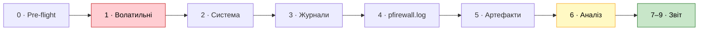

<div align="center">

# 🛡️ SOC Live Response Collector

**Один PowerShell-скрипт для збору доказів і первинного аналізу Windows-хоста**

[](#1-вимоги)
[](#1-вимоги)
[](https://csrc.nist.gov/pubs/sp/800/86/final)
[](soc-collect.ps1)
[](#1-вимоги)

[🇬🇧 English](README.md) · **🇺🇦 Українська**

</div>

---

`soc-collect.ps1` — **SOC Live Response Collector v1.4**. Замінює основний аудит + `fwlog.ps1` + `filesinter.ps1`
одним файлом: збирає волатильні дані, персистентність, журнали подій, `pfirewall.log` і файлові артефакти,
корелює їх, будує timeline і автономний HTML-звіт — з chain of custody та SHA256-маніфестом.
Порядок і принципи роботи узгоджено з **NIST SP 800-86**.

<table>
<tr>
<td width="50%" valign="top">

### ✨ Можливості

- ⚡ **Спочатку волатильні дані** — процеси, мережа, сесії, DNS/ARP
- 🔍 **IOC-пошук** за іменами, SHA256 та IP у всіх джерелах
- 📜 **Журнали подій** — автентифікація, RDP, служби, задачі, firewall, Defender, Sysmon, PowerShell 4104
- 🧱 **pfirewall.log** — зведення, евристики сканування / RDP / SMB
- 🗂️ **Артефакти** — LNK, BAM/DAM, Prefetch, кошик, MotW, історія браузерів

</td>
<td width="50%" valign="top">

### 🔐 Криміналістична коректність

- 🧾 **Chain of custody** — кожна дія з UTC-часом і оператором
- #️⃣ **Hash до → копія → hash після** для кожної копії доказу
- 🕒 **MAC-часи** фіксуються до читання й перевіряються після
- 📦 **Маніфест SHA256** + ZIP з hash
- 🌐 **HTML-звіт без зовнішніх ресурсів** — працює на ізольованій машині

</td>
</tr>
</table>

## ⚡ Швидкий старт

```powershell
# Адмінська консоль PowerShell
powershell.exe -ExecutionPolicy Bypass -File C:\1\soc-collect.ps1 -CaseId INC-0922
```

Відкрийте `C:\SOC_Evidence\<CaseId>_<HOST>_<timestamp>Z\report.html` у браузері.

> [!WARNING]
> Дефолтні IOC і маски налаштовані під навчальний кейс **KMSAuto**. Для нової справи **обов'язково** передайте
> свої `-NamePatterns`, `-IocIPs`, `-IocSha256`, `-KnownPaths` — інакше `*activ*` дасть сотні хибних спрацювань.

<details>
<summary><b>📑 Зміст</b></summary>

1. [Вимоги](#1-вимоги)
2. [Способи запуску](#2-способи-запуску)
3. [Параметри](#3-параметри)
4. [Типові сценарії](#4-типові-сценарії)
5. [Етапи роботи](#5-етапи-роботи)
6. [Результати](#6-результати)
7. [Сумісність з PowerShell 5.1](#7-сумісність-з-powershell-51)
8. [Усунення проблем](#8-усунення-проблем)
9. [Обмеження](#9-обмеження-чесно)

</details>

---

## 1. Вимоги

| Що | Вимога |
|---|---|
| PowerShell | **Windows PowerShell 5.1** (стандарт у Windows 10/11, Server 2016+) або PowerShell 7.x на Windows, 64-бітний процес, режим `FullLanguage`. Перевіряється **до** будь-якого запису на диск (`#Requires -Version 5.1` + перевірка під час запуску, код виходу `2`) |
| Права | **Адміністратор** (без них — немає Security-журналу, BAM, частини даних; скрипт попередить) |
| ОС | Windows 10 / 11, Windows Server 2016 / 2019 / 2022 / 2025 |
| Кодування файлу | UTF-8 **з BOM** — не перезберігайте в редакторі без BOM, інакше кирилиця в 5.1 зламається |
| Сторонні утиліти | Не потрібні |

> [!NOTE]
> Перевірено: v1.0 — повний прогін на Windows 11 / PowerShell 5.1.26100, **34/34 кроки без помилок**.
> v1.1 — повний прогін на контролері домену (Windows Server, PS 5.1), 64- і 32-біт: 35/35 кроків OK; знахідки цього прогону — основа виправлень v1.2.
> v1.2 — повторний прогін на тому ж DC (64-біт і автоперезапуск з 32-біт): усі кроки OK, виправлення підтверджено.
> v1.3 — прогін на DC OK (аудит конфігурації безпеки, 19 журналів експортовано).
> v1.4 додає кроки Active Directory (лише на DC); парсер і unit-тести пройдено, прогін на Windows — попереду, див. [CHANGELOG](CHANGELOG.md).

> [!TIP]
> Завантажуйте скрипт через **Download raw file** або `git clone` — репозиторій зберігає файл побайтно
> (BOM + CRLF, див. `.gitattributes`). Копіювання тексту зі сторінки GitHub в редактор може втратити BOM.

---

## 2. Способи запуску

### 2.1 Через `-File` — основний

```powershell
powershell.exe -ExecutionPolicy Bypass -File C:\1\soc-collect.ps1 -CaseId INC-0922
```

- SHA256 рахується від самого файлу скрипта (найкращий варіант для chain of custody).
- **Списки передаються одним рядком через кому** — скрипт сам їх розіб'є:
  ```powershell
  -IocIPs '192.168.23.51,10.3.0.20' -NamePatterns '*KMS*,*SECOPatcher*'
  ```

### 2.2 Через scriptblock

```powershell
powershell.exe -ExecutionPolicy Bypass -Command "& ([scriptblock]::Create((Get-Content -Raw -Encoding UTF8 'C:\1\soc-collect.ps1'))) -CaseId INC-0922 -IocIPs @('192.168.23.51','10.3.0.20')"
```

- Масиви працюють нативно через `@(...)`.
- Hash фіксується від тексту скрипта (може відрізнятися від hash файлу через BOM/переноси — у звіті це позначено).

### 2.3 З уже відкритої адмінської консолі

```powershell
Set-ExecutionPolicy -Scope Process Bypass
cd C:\1
.\soc-collect.ps1 -CaseId INC-0922 -Hours 72
```

### 2.4 Віддалено (WinRM)

```powershell
Invoke-Command -ComputerName PC-17 -FilePath C:\1\soc-collect.ps1 -ArgumentList 'HUNT-PC17'
```

- `-ArgumentList` передає параметри **лише за позицією** (перший — `CaseId`).
- Результати лишаються на віддаленому хості в `C:\SOC_Evidence` — заберіть їх після збору.

---

## 3. Параметри

### 🗂️ Справа і час

| Параметр | За замовчуванням | Опис |
|---|---|---|
| `-CaseId` | `INC-testPC_1-KMSAuto` | Ідентифікатор справи (назва папки, звіту) |
| `-Analyst` | — | Ім'я аналітика для chain of custody |
| `-Hours` | `48` | Вікно журналів: останні N годин (якщо не задано `-Since`) |
| `-Since` | зараз − `Hours` | Початок вікна, **формат ISO**: `'2026-09-22 00:00'` |
| `-Until` | момент запуску | Кінець вікна |

> [!IMPORTANT]
> Дати — лише у форматі `yyyy-MM-dd HH:mm`. Формат `22.09.2026` PowerShell не розбере.

### 🎯 IOC та пошук

| Параметр | За замовчуванням | Опис |
|---|---|---|
| `-NamePatterns` | `*KMS*`, `*activ*`, `*SECOPatcher*` | Маски імен файлів (пошук по дисках, LNK, BAM, Prefetch, кошик, історія браузерів) |
| `-KnownPaths` | шляхи KMSAuto | Конкретні файли/папки: hash, підпис, MAC до/після, Zone.Identifier |
| `-IocSha256` | hash KMSAuto++ і архіву | Шукаються у файлах, процесах, службах, Sysmon |
| `-IocIPs` | `192.168.23.51`, `fe80::105:…`, `10.3.0.20` | Шукаються в з'єднаннях, ARP/NDP, pfirewall.log, RDP, 4625, реєстрі KMS |
| `-SearchRoots` | усі локальні та знімні диски | Де шукати файли |
| `-ExcludeDirs` | WinSxS, DriverStore, servicing… | Фрагменти шляхів, які пропускаються |

### 💾 Куди зберігати

| Параметр | За замовчуванням | Опис |
|---|---|---|
| `-OutRoot` | `C:\SOC_Evidence` | Коренева папка результатів |

> [!CAUTION]
> **NIST:** не пишіть докази на диск, який досліджуєте, — запис затирає вільне місце, де можуть бути
> видалені файли. Для серйозних кейсів: `-OutRoot E:\Evidence` (флешка / зовнішній диск).

### 📏 Ліміти

| Параметр | За замовчуванням | Опис |
|---|---|---|
| `-MaxEvents` | `5000` | Максимум подій на запит до журналу. Якщо у звіті «досягнуто ліміту» — збільште |
| `-MaxHashMB` | `300` | Файли більші за цей розмір не хешуються |
| `-HtmlMaxRows` | `400` | Рядків на таблицю в HTML (у CSV — завжди повні дані) |

### 🎚️ Перемикачі

| Перемикач | Що робить | Коли вмикати |
|---|---|---|
| `-SkipWideSearch` | Без пошуку по всіх дисках | Швидкий тріаж (найдовший крок) |
| `-SkipEvidenceCopy` | Без копій історії браузерів / Timeline / PS history / pfirewall.log | Hunting на багатьох хостах |
| `-CollectHives` | `reg save` SYSTEM/SOFTWARE + Amcache через `esentutl /vss` | Глибока форензика. ⚠️ Створює тіньову копію — змінює систему (фіксується в custody) |
| `-UsnJournal` | Вибірка з USN-журналу за масками | Потрібно знати, коли файли створювалися/видалялися. Довго |
| `-NoEvtx` | Без експорту оригінальних `.evtx` (крок 3.9) | Hunting на багатьох хостах / мало місця. За замовчуванням журнали експортуються повністю — на DC Security може бути 1+ ГБ, тому `-OutRoot` на зовнішній диск |
| `-NoZip` | Без ZIP-архіву | Коли архів не потрібен |

---

## 4. Типові сценарії

<details open>
<summary><b>🚨 Повний розбір інциденту</b></summary>

```powershell
.\soc-collect.ps1 -CaseId INC-0922 -Analyst "Прізвище" `
  -Since '2026-09-22 00:00' -Until '2026-09-23 00:00' -OutRoot E:\Evidence
```
</details>

<details>
<summary><b>⏱️ Швидкий тріаж (~1–2 хв)</b></summary>

```powershell
.\soc-collect.ps1 -CaseId TRIAGE-PC17 -Hours 24 -SkipWideSearch -SkipEvidenceCopy -NoZip
```
</details>

<details>
<summary><b>🎯 Threat hunting по інших хостах (ті самі IOC)</b></summary>

```powershell
.\soc-collect.ps1 -CaseId HUNT-PC17 -Since '2026-09-15 00:00' -SkipEvidenceCopy `
  -IocIPs '192.168.23.51,10.3.0.20' -NamePatterns '*KMS*,*SECOPatcher*'
```

Дивіться розділи **«IOC-збіги»** та **«Автентифікація / brute-force»**.
</details>

<details>
<summary><b>🔬 Глибока форензика</b></summary>

```powershell
.\soc-collect.ps1 -CaseId INC-0922-DEEP -CollectHives -UsnJournal -MaxEvents 50000 -OutRoot E:\Evidence
```
</details>

<details>
<summary><b>🧪 Перевірка «чистої» системи / нова справа</b></summary>

```powershell
.\soc-collect.ps1 -CaseId CHECK-HOME -Hours 168 -NamePatterns '*anydesk*,*rat*' -IocIPs '0.0.0.0' -KnownPaths 'C:\nonexistent'
```
</details>

---

## 5. Етапи роботи

Порядок NIST: **спочатку волатильні дані**.



| Етап | Що збирається |
|---|---|
| **0. Pre-flight** | SHA256 скрипта, час/таймзона/NTP, NTFS last-access, Prefetch, профілі користувачів |
| **1. Волатильні** | Спочатку швидкий знімок (TCP/UDP → процеси), далі ARP/NDP, DNS-кеш, IP/маршрути, SMB; лише потім — власник/hash/підпис процесів і сесії |
| **2. Система** | Облікові записи, адміни, політики, служби, задачі (автор з XML), автозапуск, WMI, Defender, ліцензування/KMS, firewall, **журнали подій (розмір/глибина/покриття) та налаштування аудиту**  **Аудит конфігурації безпеки** (SMBv1/signing, LLMNR/NetBIOS, WDigest, LSA PPL, Credential Guard, NTLM/LM, UAC, RDP NLA, PowerShell v2, BitLocker, ASR, LAPS, Гість, Spooler на DC, профілі firewall, останнє оновлення) ; **на DC: конфігурація AD** через LDAP (облікові записи під Kerberoasting / AS-REP, неконтрольоване делегування, вік krbtgt, прапорці привілейованих, MachineAccountQuota, парольна політика і блокування, склад привілейованих груп) |
| **3. Журнали за вікно** | 4625/4624/4648/4740/4776, зміни облікових записів, очищення журналів, RDP (1149, 21–25, 131, 140), служби (7045/4697/7040), задачі (4698–4702, TaskScheduler), зміни firewall (2004–2006, 2033, 2052, 2097, 2099, 4946–4950), Defender, LOLBin/IOC-запуски (Sysmon 1 / 4688), Sysmon 11/13/3, PowerShell 4104 ; **повний експорт оригінальних `.evtx`** з SHA256 ; **на DC: ознаки атак на AD** — Kerberoasting (4769 RC4), AS-REP roasting (4768), Kerberos spraying (4771), DCSync (4662), привілейовані групи, userAccountControl, ACL/RBCD/Shadow Credentials/GPO (5136), з перевіркою покриття аудиту |
| **4. pfirewall.log** | Зведення по портах і джерелах, ALLOW/DROP, first/last, евристики (ICMP-розвідка, RDP/SMB, сканування), IOC IP |
| **5. Файлові артефакти** | Відомі шляхи, пошук за масками, LNK (з ціллю), BAM/DAM, Prefetch, кошик ($I), Zone.Identifier, копії історії браузерів / Windows Timeline / PS history з пошуком підказок |
| **6. Аналіз** | Зведення brute-force, кореляція 4625 ↔ firewall ↔ RDP, IOC-збіги, автоматичні прапорці |
| **7–9. Звіт** | Timeline (UTC), HTML, chain of custody, маніфест SHA256, ZIP + hash |

---

## 6. Результати

```text
C:\SOC_Evidence\<CaseId>_<HOST>_<yyyyMMdd_HHmmss>Z\
├── report.html                  ← головний звіт (відкрити в браузері)
├── findings_auto.csv            ← автоматичні прапорці
├── timeline_full.csv            ← повний timeline (UTC + локальний час)
├── ioc_hits.csv                 ← усі IOC-збіги
├── integrity_copies.csv         ← hash до / копія / після для кожної копії
├── chain_of_custody.log / .csv  ← кожна дія: seq, UTC, оператор, об'єкт, результат
├── collection_steps.csv         ← кроки збору, статус, помилки з номером рядка
├── collection_notes.txt         ← обмеження збору (урізані журнали тощо)
├── manifest.csv                 ← SHA256 кожного файлу справи
├── manifest.csv.sha256          ← hash маніфесту
├── 00_tool\                     ← копія скрипта, яким збирали
├── 01_volatile\  02_system\  03_eventlogs\  04_firewall\  05_artifacts\
├── 02_system\security_config_audit.csv  ← аудит налаштувань безпеки
├── 03_eventlogs\evtx\                  ← оригінальні журнали (.evtx) + evtx_export.csv
├── 02_system\ad_config.csv, ad_risky_accounts.csv          ← конфігурація AD (лише DC)
├── 03_eventlogs\ad_attack_findings.csv / _events.csv / ad_audit_coverage.csv ← ознаки атак на AD (лише DC)
└── 06_evidence_copies\          ← верифіковані копії (браузери, pfirewall.log, кущі)
<CaseDir>.zip  +  <CaseDir>.zip.sha256
```

> [!TIP]
> **Для тікета:** зафіксуйте SHA256 маніфесту та архіву (виводяться в кінці) — це точка контролю цілісності.

### 📊 HTML-звіт

- Бокове меню — 19 розділів (зокрема **5.1 Active Directory** на DC), зокрема **4.1 Налаштування безпеки** (поточне / рекомендоване / виправлення / чому) і таблиця експорту `.evtx`
- Картки-лічильники та таблиця прапорців з рівнем (Критично / Високо / Середньо / Інфо)
- У кожній таблиці: **фільтр** (поле пошуку) і **сортування** (клік по заголовку)
- Підсвітка: 🟥 IOC / критично, 🟧 підозріло, 🟩 VERIFIED / OK
- Повністю автономний (без зовнішніх ресурсів) — відкривається на ізольованій машині

> [!NOTE]
> Прапорці — **підказки**, не висновки. Висновок робить аналітик після перевірки кількох незалежних джерел (NIST 8.3).

---

## 7. Сумісність з PowerShell 5.1

| Питання | Стан |
|---|---|
| Синтаксис | Без конструкцій лише з PS7 (`??`, `?:`, `&&`, `-Parallel`) |
| Кодування | UTF-8 з BOM — 5.1 читає кирилицю коректно |
| Модулі | Лише вбудовані: NetSecurity, NetTCPIP, ScheduledTasks, Defender, LocalAccounts, CimCmdlets |
| Локалізація ОС | Дані з журналів беруться з XML (не з локалізованого тексту); `auditpol` — розбір EN/RU/UA |
| Перевірено | v1.0: Windows 11 + PS 5.1.26100, 34/34 OK; v1.1: контролер домену, PS 5.1 64/32-біт, 35/35 OK; v1.2: повторний прогін на DC OK; v1.3: DC OK; v1.4: парсер + unit-тести, прогін на Windows — попереду |

---

## 8. Усунення проблем

| Симптом | Причина / рішення |
|---|---|
| `ПОМИЛКА: потрібен PowerShell 5.1+` / помилка `#requires` | Встановіть WMF 5.1 або запускайте через `powershell.exe` (5.1) / `pwsh.exe` (7.x) |
| `ПОМИЛКА: LanguageMode = ConstrainedLanguage` | PowerShell обмежено AppLocker/WDAC; запускайте з дозволеного адмін-контексту або додайте скрипт у виключення |
| Попередження про 32-бітний PowerShell | При запуску через `-File` скрипт сам перезапускається в 64-бітному PowerShell (`Sysnative`). Інакше (scriptblock, pwsh x86) запускайте `%SystemRoot%\System32\WindowsPowerShell\v1.0\powershell.exe` |
| `не може бути завантажений, оскільки виконання сценаріїв вимкнено` | Додайте `-ExecutionPolicy Bypass` або `Set-ExecutionPolicy -Scope Process Bypass` |
| Кракозябри замість кирилиці | Файл перезбережено без BOM. Збережіть як **UTF-8 with BOM** або запускайте через scriptblock з `-Encoding UTF8` |
| `Не вдається перетворити значення … на тип System.DateTime` | Дату задано не в ISO. Використовуйте `'2026-09-22 00:00'` |
| Список IOC розпізнано як один елемент | При `-File` — через кому в одному рядку: `'a,b,c'` |
| Порожній Security-журнал, BAM | Запущено без прав адміністратора |
| У звіті «досягнуто ліміту N подій» | Збільште `-MaxEvents` |
| `COPY-ONLY` у верифікації копій | Файл був заблокований (напр. Chrome відкритий). Hash копії зафіксовано — це нормально |
| `SOURCE_CHANGED` для pfirewall.log | Активний лог дописується під час копіювання — очікувано, доказ — копія |
| Крок має статус `ПОМИЛКА` | Дивіться `collection_steps.csv`: там текст помилки і **номер рядка**. Інші кроки не зачіпаються |
| Порожній Prefetch | На Windows Server Prefetch вимкнено за замовчуванням — це не доказ відсутності запуску |
| «Вікно розслідування не покрите» | Журнал замалий і вже перезаписав події. Команда збільшення — у колонці Advice |
| Сотні прапорців «Програма в нестандартному шляху» | Маски/IOC від іншої справи або ігри/програми на D:/E:. Змініть `-NamePatterns` під справу |

---

## 9. Обмеження (чесно)

- **Live response** — без write blocker і bit-stream образу. Для доказів юридичного рівня спочатку зробіть снапшот/образ VM.
- Немає дампа оперативної пам'яті.
- Сирі `.evtx` не експортуються — лише CSV-вибірки.
- Історія браузерів / Timeline аналізується пошуком рядків (без SQLite) — без точних часових міток; для таймінгу відкрийте копії в DB Browser for SQLite.
- Рекомендовані розміри журналів — орієнтовні (для навантажених серверів / DC Security ≥ 4 ГБ).
- IP-адреса у кореляції — **кандидат**, не доказ ідентичності (NIST 6.4.4).

---

<div align="center">
<sub>Використовуйте лише на системах, які ви маєте право досліджувати. За замовчуванням скрипт лише читає дані (крім <code>-CollectHives</code>), але це live response — див. <a href="#9-обмеження-чесно">обмеження</a>.</sub>
</div>
